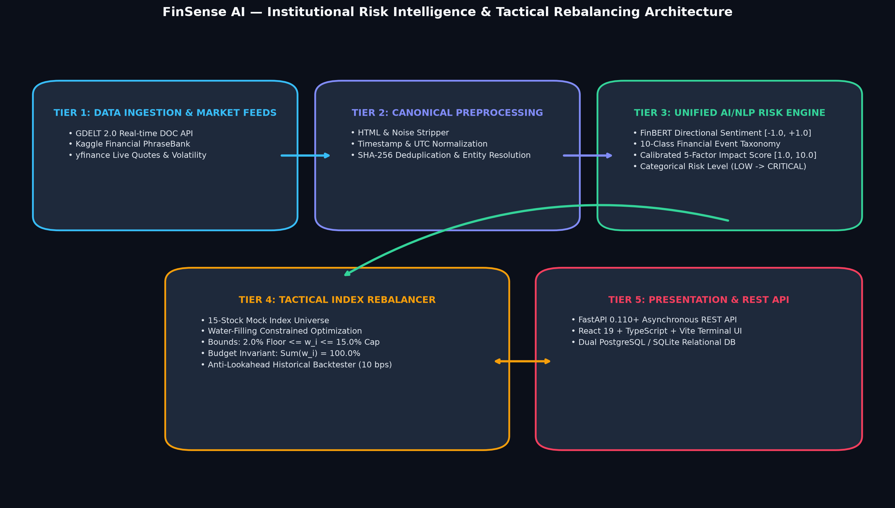

# FinSense AI — S&P Global & CRISIL Campus Hackathon 2026
## Module A: AI/NLP Risk Engine & Tactical Stock Index Rebalancer

[](https://fastapi.tiangolo.com)
[](https://react.dev)
[](https://github.com/ranaroussi/yfinance)
[](LICENSE)

**Candidate Name:** Karaka Tejaswanth  
**College Email ID:** karaka.tejaswanth2023@vitstudent.ac.in  
**College / Campus:** Vellore Institute of Technology (VIT), Vellore  
**Module:** Module A — AI/NLP Risk Engine & Tactical Stock Index Rebalancer  
**Demo Video (YouTube Unlisted):** https://www.youtube.com/watch?v=CCwh2Zyxdgw  
**Presentation Deck:** [docs/presentation.pdf](docs/presentation.pdf)  
**Source Repository:** https://github.com/Teja-k057/FinSense-AI

---

## 1. Project Overview / Problem Statement & Approach

Financial markets produce more news than a person can comfortably review one headline at a time. FinSense AI is a prototype that converts public financial news and market data into structured risk signals, then turns those signals into explainable proposed changes to a stock-index allocation.

The system ingests news from the GDELT 2.0 DOC API and a public Financial News PhraseBank mirror, applies sentiment analysis, rule-based financial-event classification and an explainable impact score, and combines the signals with market-momentum data. The rebalancer generates target weights for a **15-stock mock universe**, subject to a **2% minimum weight**, **15% maximum weight**, and **100% total portfolio weight**. Its dashboard shows news, risk signals, before/after allocations, stock-level decision explanations and a historical comparison against an equal-weight baseline.

This is an academic hackathon prototype. It is not an official S&P Global or CRISIL product or methodology, does not represent realized investment performance, and is not financial or investment advice.

## 2. Architecture & Tech Stack



**Data flow:** Public financial news and market quotes → ingestion and deduplication → sentiment, event and impact analysis → tactical signal calculation → bounded portfolio allocation → dashboard explanations and historical simulation.

**Main technology choices**
- **Backend:** Python, FastAPI, SQLAlchemy and Pydantic.
- **Frontend:** React 19, TypeScript and Vite.
- **Storage:** SQLite by default; PostgreSQL can be configured.
- **Inputs:** GDELT 2.0 DOC API, a public Financial PhraseBank mirror, and yfinance quotes/history.
- **NLP:** Explainable financial lexicon is the default sentiment implementation; local FinBERT inference is optional and must be enabled/configured with its extra dependencies. Event classification is rule-based; the impact score is a project-defined, explainable score.

## 3. Dataset Used

- **GDELT 2.0 DOC API:** public news results are fetched at run time. Availability, relevance and historical coverage depend on the upstream service.
- **Financial News PhraseBank:** the public corpus is downloaded through the source URL configured in `backend/app/config/settings.py` and cached locally after validation.
- **Synthetic sample:** `data/sample_financial_news.csv` contains clearly labelled synthetic example headlines so reviewers can inspect the expected input shape. They are not real news articles.
- **Market prices/history:** fetched through yfinance and subject to upstream availability and caching.
- **GDELT failure behavior:** the adapter used by the current API route returns an error and an empty record set after a failed live request; it does not label fabricated records as live. A legacy ingestion module also exists in the repository and contains seed examples, so use the documented API route for the live-ingestion demo.

No confidential or proprietary S&P Global or CRISIL client data is used. Runtime cache files and the local database are not committed. The 15-stock index is a mock universe.

## 4. Quickstart & Installation

**Prerequisites:** Python 3.10 or later, Node.js 18 or later, npm, and Git. Tested on Windows (PowerShell & CMD), Linux, and macOS.

### Step 1: Clone Repository & Install Dependencies
From your terminal, clone the repository and install all dependencies:

```bash
git clone https://github.com/Teja-k057/FinSense-AI.git
cd FinSense-AI

# Install Python backend dependencies
pip install -r requirements.txt

# Install frontend dependencies
cd frontend
npm install
cd ..
```

---

### Option 1: 1-Click Launch (Easiest for Windows)

From the project root directory, launch both the FastAPI backend and React frontend automatically:

- **Using File Explorer:** Double-click `run.bat` (or `scripts\run_dev.bat`).
- **Or using PowerShell:**
  ```powershell
  .\run.ps1
  ```
  *(or `.\scripts\run_dev.ps1`)*

This automatically launches two dedicated terminal windows:
1. **Backend API Server** running on `http://localhost:8000`
2. **Frontend UI Console** running on `http://localhost:5173`

---

### Option 2: Step-by-Step Manual Launch

If you prefer running the servers manually in separate terminal windows:

**Terminal 1 — Start the Backend API (FastAPI):**
```bash
python -m uvicorn backend.app.main:app --host 0.0.0.0 --port 8000 --reload
```
*(The backend automatically checks and initializes all 8 database tables upon startup).*

**Terminal 2 — Start the Frontend Dashboard (React + Vite):**
```bash
cd frontend
npm run dev
```

---

### Accessing the Platform

Once the servers are running, access the services in your browser:
- 📊 **FinSense AI Dashboard (Web UI):** [http://localhost:5173](http://localhost:5173)
- 📖 **Backend API Swagger Documentation:** [http://localhost:8000/docs](http://localhost:8000/docs)
- 🩺 **Health Check Endpoint:** [http://localhost:8000/api/v1/health](http://localhost:8000/api/v1/health)

SQLite is the default database (`data/risk_engine.db`). To customize local settings, copy `.env.example` to `.env` and change only the options you need. Never commit real credentials, a populated local database or personal access tokens.

**Run backend tests:**

```bash
python -m unittest discover -s tests -p "test_*.py"
```

**Build the frontend:**

```bash
cd frontend
npm run build
```

The repository contains automated tests, but test status should be verified by running the command above in the final submission environment.

## 5. Key Results & Domain Impact

The prototype demonstrates the path from a financial-news headline to a sentiment/event/impact signal, a bounded stock-weight proposal, and a plain-language explanation of why the allocation changed. The constraints are designed to avoid removing a constituent or letting a single name dominate the 15-stock mock portfolio.

**Latest dashboard run recorded for the demo — 1-month period, daily rebalancing, ending 7 October 2026:**

| Metric | NLP tactical strategy | Equal-weight baseline |
|---|---:|---:|
| Cumulative return | -1.33% | -3.59% |
| Maximum drawdown | -2.93% | -4.46% |
| Annualized volatility shown | 9.40% | 9.52% |
| Sharpe ratio shown | -1.45 | -3.46 |

The displayed active return difference was **+2.26 percentage points**, net of the configured 10 bps transaction-cost model. The dashboard also showed **27.12% total turnover** and an **83% period win rate** for that run. Results depend on the chosen window, rebalance frequency, data availability and current database/cache state; they may differ on another run. Both cumulative returns in this example are negative, so this result means the simulated strategy lost less than the baseline during that specific run, not that it generated a positive return.

**Potential domain impact:** reduce manual news-triage effort, expose event-driven risk signals, make proposed allocation changes easier to review, and enforce transparent portfolio-weight bounds. These are prototype capabilities, not evidence of production readiness or live-market alpha.

## Dashboard Sections

1. **Executive Overview:** tracked-universe and risk-signal summary.
2. **News & Signals:** searchable news/risk feed.
3. **Index Composition:** constituent quotes and current/target weights.
4. **Rebalancing Analysis:** explanation for individual allocation decisions.
5. **Stock Analysis:** ticker-level market, signal and allocation details.
6. **Event Classification:** taxonomy labels and signal context.
7. **Historical Performance:** comparison between the tactical simulation and equal-weight baseline.

## Selected API Endpoints

| Method | Endpoint | Purpose |
|---|---|---|
| GET | `/api/v1/health` | Service and database health |
| GET | `/api/v1/risk-signals` | Query persisted risk signals |
| POST | `/api/v1/ingest/gdelt` | Request GDELT news ingestion |
| POST | `/api/v1/ingest/kaggle` | Request PhraseBank ingestion |
| POST | `/api/v1/ingest/unified` | Combine news sources into the canonical feed |
| GET | `/api/v1/rebalancer/index` | Get the 15-stock mock index |
| POST | `/api/v1/rebalancer/rebalance` | Calculate constrained target weights |
| POST | `/api/v1/rebalancer/backtest` | Run the historical comparison |

See the interactive OpenAPI page at http://localhost:8000/docs when the backend is running.

## Methodology & Limitations

### Tactical signal

The implementation aggregates sentiment by impact and adjusts its sentiment tilt using event impact/severity. Market momentum is clamped and normalized before fusion:

```text
tactical_signal = clip(0.80 * impact_adjusted_sentiment
                       + 0.20 * normalized_momentum, -1, +1)
raw_target_weight = current_weight * (1 + 0.60 * tactical_signal)
```

An iterative bounded allocation step then applies the configured 2% floor, 15% cap and 100% total-weight constraint. The displayed impact score is an explainable, project-defined score, not an official external rating.

### Backtest assumptions and limitations

- The simulator compares a 15-stock equal-weight baseline with the tactical strategy and deducts the configured 10 bps transaction-cost model.
- Stored news signals are filtered by timestamp at each simulated rebalance. However, the current implementation's momentum signal comes from the regular quote/cache service rather than a fully reconstructed historical, timestamp-specific feature snapshot. Therefore the end-to-end backtest should **not** be described as a fully validated, strict point-in-time simulation.
- If the market-data service cannot retrieve enough historical dates, the code may use synthetic fallback prices. Check the run's dates, data availability and assumptions before quoting results.
- The prototype assumes no additional market-impact/slippage costs beyond its transaction-cost model. Public feeds may be unavailable or return different records over time.
- Local FinBERT is optional; the default sentiment engine uses an explainable financial lexicon and event classification uses deterministic rules.

## License & Security

Released under the [MIT License](LICENSE). Keep credentials in a local `.env` file and do not commit it. Do not commit local databases, private keys, access tokens or confidential data.
